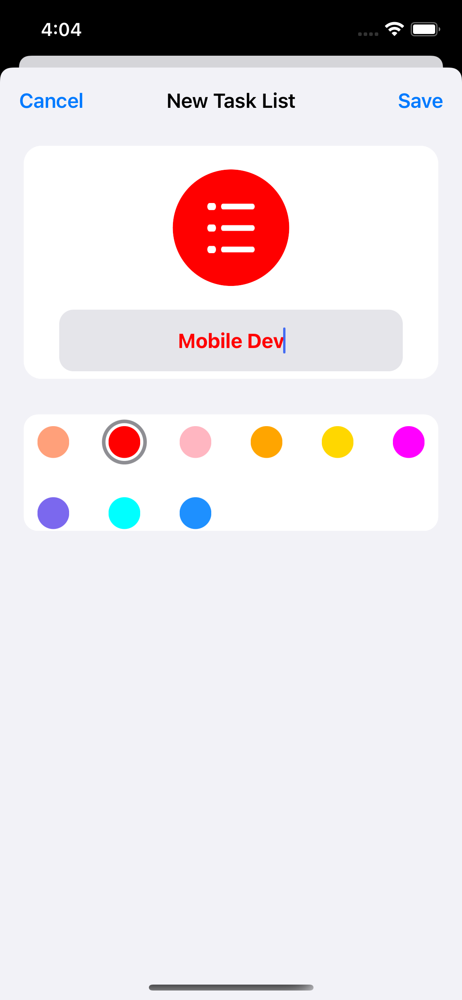
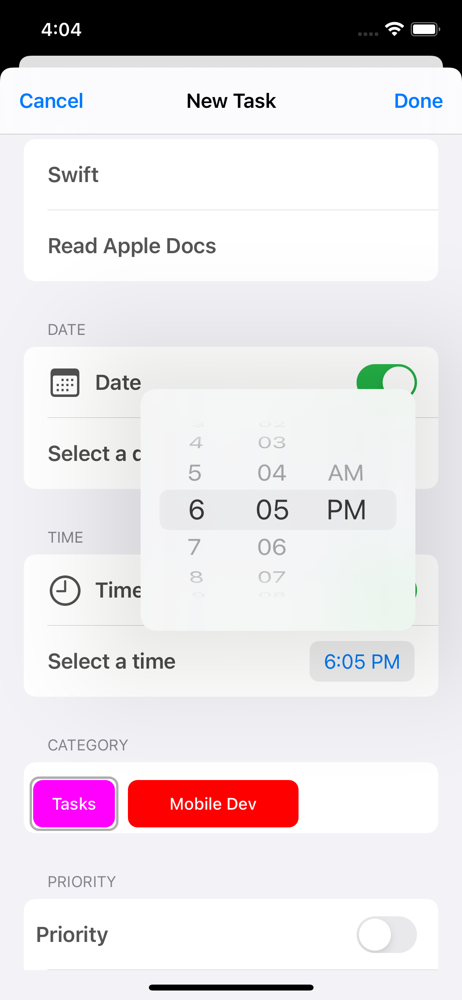
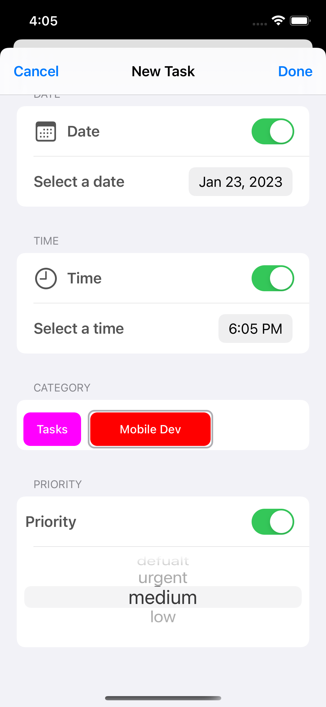
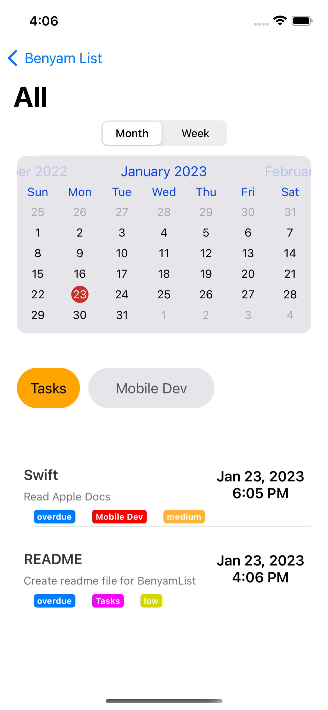
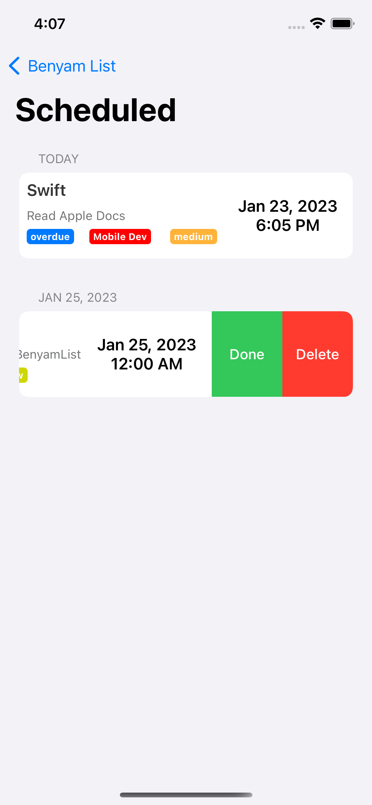
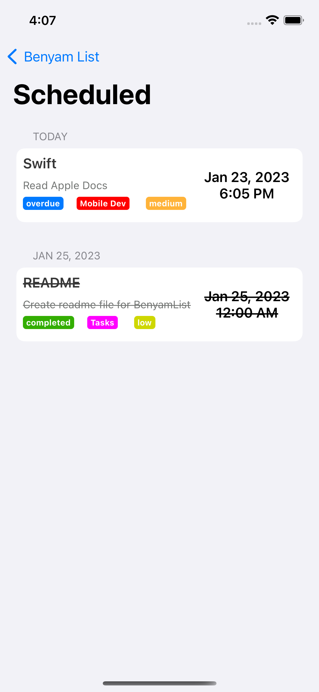

# BenyamList - To-Do List
BenyamList is a simple iOS application to save Your daily tasks in order not to miss anything.

## Features

#### TaskList
* Create a tasklist/category for a task
* Select a color and title for category
* Edit a tasklist/category
* Delete a tasklist/category

#### Task
* For category add a new task
* Select a date/time/category/priority for a task if necessarry
* Mark task as completed
* Edit task
* Delete task
* Pick a date or weekday to see tasks for that day

## Technologies used:
* Swift
* FSCalendar
* Charts

## App Screens

#### Home

  
  

#### Adding task

  
  

#### Main section

  
  

#### Scheduled Section

  
  

## Sources
This app is inspired by Apple's "Reminders" app
